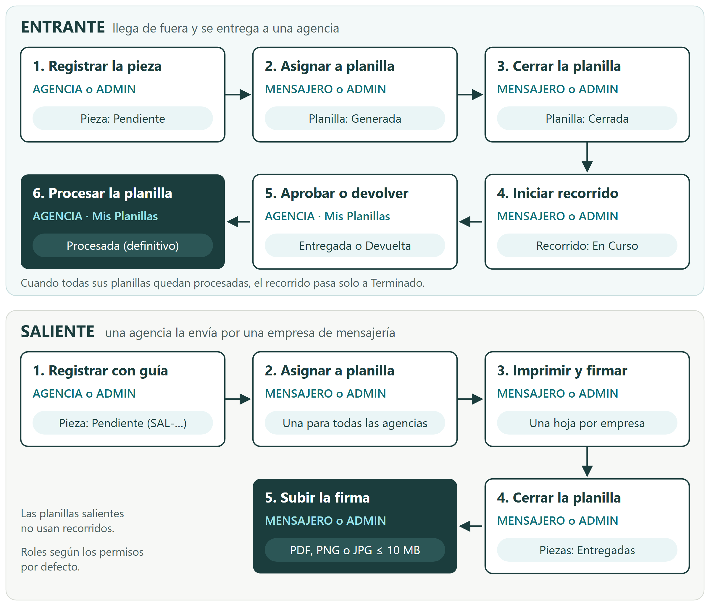

## Historial de cambios

| Versión | Fecha | Origen | Cambio |
|---|---|---|---|
| 1.0 | 2026-10-01 | Flujo H-003 (cierre) | Creación del manual. Describe el producto tal como quedó tras la remediación de la segunda auditoría de seguridad y la revisión Guardian independiente (R-027…R-047). |

## 1. Conocer SISMAR

### 1.1 Para qué sirve

SISMAR registra y sigue la correspondencia de su organización:

- La **correspondencia entrante**: lo que llega desde fuera y debe entregarse a una agencia o área interna.
- La **correspondencia saliente**: lo que una agencia envía hacia fuera por medio de una empresa de mensajería.

Con SISMAR usted agrupa las piezas en **planillas de entrega**, organiza **recorridos** de mensajería, confirma qué recibió cada agencia, consulta **reportes** y administra los catálogos, los usuarios y los permisos.

### 1.2 Quién lo usa

Cada usuario tiene un **rol**. El rol define qué datos ve y qué puede hacer por defecto. El administrador puede ajustar los permisos de cada rol y de cada persona (vea la sección 10.4).

| Rol | Alcance de los datos | Qué hace por defecto |
|---|---|---|
| **ADMIN** (Administrador) | Toda la organización. | Todo: registra correspondencia, arma planillas, organiza recorridos, consulta reportes y es el único que administra configuración, usuarios, permisos y catálogos. |
| **MENSAJERO** | Toda la operación logística. | Ve la correspondencia entrante y saliente, arma y gestiona planillas, inicia y anula recorridos. No aprueba ni devuelve piezas en nombre de una agencia. |
| **AGENCIA** | Solo su propia agencia. | Registra y completa la correspondencia de su agencia, ve sus planillas, recibe lo que le llega (aprueba, devuelve y procesa) y consulta los reportes de su agencia. |

> **Importante.** Un usuario con rol AGENCIA siempre tiene una agencia asignada. Si por algún motivo no la tuviera, SISMAR no le muestra ningún dato hasta que el administrador se la asigne.

### 1.3 Cómo viaja una pieza

La figura resume el recorrido de una pieza entrante y de una saliente, y quién interviene en cada paso con los permisos por defecto.

### 1.4 Lo que ve depende de sus permisos

El menú lateral solo muestra los módulos a los que usted tiene acceso. Si entra a un módulo sin permiso, por ejemplo con un enlace guardado, SISMAR muestra la pantalla **Acceso denegado** (vea la sección 11).

Los botones también cambian según sus permisos. Por ejemplo, si usted puede ver planillas pero no gestionarlas, no verá los botones para cerrarlas o reabrirlas.

## 2. Ingresar y salir del sistema

### 2.1 Ingresar

1. Abra en su navegador la dirección de SISMAR que le entregó su organización (por ejemplo, `https://sismar.ejemplo.test`, valor ficticio).
2. Escriba su **Usuario** y su **Contraseña**.
3. Pulse **Ingresar**.

SISMAR abre la pantalla de **Inicio**. Si ya tenía una sesión válida y entra a la página de acceso, el sistema lo lleva directo a Inicio.

> **Nota.** Su contraseña la crea el administrador. Debe tener al menos 8 caracteres, con al menos una mayúscula, una minúscula y un número. SISMAR no ofrece recuperación de contraseña por correo: si la olvida, pida al administrador que le asigne una nueva.

### 2.2 Resolver un problema de acceso

| Mensaje | Qué significa | Qué hacer |
|---|---|---|
| *Por favor ingrese usuario y contraseña* | Dejó un campo vacío. | Complete ambos campos. |
| *Credenciales inválidas* | El usuario o la contraseña no coinciden, **o la cuenta está bloqueada**. Por seguridad, el mensaje es el mismo en todos los casos. | Revise mayúsculas y minúsculas. Si persiste, espere 15 minutos o pida ayuda al administrador. |
| *Demasiados intentos. Espere N segundos e intente de nuevo.* | Hubo demasiados intentos seguidos en poco tiempo. | Espere el tiempo indicado. |
| *Su sesión expiró o fue cerrada. Ingrese nuevamente.* | Su sesión dejó de ser válida (vea 2.3). | Ingrese de nuevo. |
| *Error en el servidor* | Falla interna del sistema. | Intente más tarde y avise al administrador. |

**Bloqueo de la cuenta.** Después de **10 intentos fallidos seguidos**, SISMAR bloquea la cuenta durante **15 minutos**. Mientras dura el bloqueo, incluso la contraseña correcta recibe *Credenciales inválidas*. El bloqueo termina solo, o antes si el administrador le asigna una contraseña nueva. Un ingreso correcto reinicia el contador.

### 2.3 Saber cuánto dura su sesión

- Su sesión dura **24 horas** desde que ingresó. No se alarga con el uso: al cumplirse el plazo, SISMAR le pide ingresar de nuevo.
- La sesión termina antes si:
  - usted pulsa **Cerrar Sesión**;
  - el administrador cambia su rol, su agencia o su contraseña;
  - el administrador elimina su usuario;
  - el equipo técnico cierra las sesiones por seguridad.
- Cuando el servidor detecta que su sesión ya no es válida, lo lleva a la página de acceso con el aviso *Su sesión expiró o fue cerrada. Ingrese nuevamente.*

### 2.4 Cerrar sesión

Pulse **Cerrar Sesión** al final del menú lateral. SISMAR invalida la sesión en el servidor: aunque alguien hubiera copiado su sesión, ya no le sirve. Cierre sesión siempre que use un equipo compartido.

### 2.5 Moverse por el sistema

El menú lateral reúne los módulos: **Inicio**, **Correspondencia Entrante**, **Correspondencia Saliente**, **Mis Planillas**, **Planillas**, **Recorridos**, **Reportes** y, solo para el administrador, **Administración**. En pantallas pequeñas, abra el menú con el botón de la esquina superior izquierda.

## 3. Consultar el resumen del día

La pantalla **Inicio** muestra un resumen de la correspondencia **dentro de su alcance** (si usted es AGENCIA, solo la de su agencia):

| Tarjeta | Qué cuenta |
|---|---|
| **Recibidas Hoy** | Piezas registradas hoy, entrantes y salientes. |
| **Pendientes de Entrega** | Piezas en estado pendiente. |
| **Entregadas Hoy** | Piezas entregadas hoy. |
| **Salientes Hoy** | Piezas salientes registradas hoy. |

Debajo encontrará **Acciones Rápidas** (accesos a Registrar Entrante, Registrar Saliente, Ver Planillas y Recorridos) y la **Actividad Reciente** con las 8 últimas piezas. Los accesos rápidos se muestran a todos; si un módulo no está en sus permisos, verá *Acceso denegado*.

## 4. Gestionar la correspondencia entrante

### 4.1 Ver la correspondencia entrante pendiente

Abra **Correspondencia Entrante**. La lista muestra las piezas entrantes **pendientes que aún no están en una planilla**. Cuando una pieza se asigna a una planilla, sale de esta lista y pasa a verse en **Planillas**.

Use el buscador para filtrar por consecutivo, remitente, asunto o agencia. Cada fila muestra el consecutivo, la fecha, el remitente y su ciudad, el asunto, la agencia de destino y la importancia (**Alta** o **Normal**, y la marca **Requiere Rpta** si necesita respuesta).

> **Nota.** SISMAR asigna el consecutivo automáticamente al registrar la pieza.

### 4.2 Registrar una pieza entrante

Necesita el permiso *Registrar Correspondencia Entrante* (lo tienen por defecto ADMIN y AGENCIA).

1. En **Correspondencia Entrante**, pulse **Agregar Entrante**.
2. Complete los datos de la tabla siguiente.
3. Pulse **Registrar Correspondencia**.

| Campo | Obligatorio | Indicaciones |
|---|---|---|
| Nombre Remitente | Sí | De 2 a 200 caracteres. |
| Ciudad Remitente | No | Elija del catálogo de ciudades. |
| Empresa Mensajería | Sí | Elija una empresa activa del catálogo. |
| Agencia / Área | Sí | Si usted es AGENCIA, solo aparece la suya. |
| Importancia | Sí | **Normal** (por defecto) o **Alta**. |
| ¿Necesita Respuesta? | No | Active el interruptor si la pieza exige respuesta. |
| Asunto | Sí | De 3 a 500 caracteres. |
| Anexos | No | Vea la sección 4.3. |

SISMAR muestra *Correspondencia registrada* y la pieza aparece en la lista en estado pendiente. Para vaciar el formulario sin guardar, pulse **Limpiar**.

### 4.3 Agregar anexos

Los anexos describen lo que viene dentro del envío (documentos, paquetes, facturas, etc.).

1. En la sección **Anexos**, elija el **Tipo de Anexo** y la **Cantidad**.
2. Si lo necesita, escriba un **identificador** por unidad (por ejemplo, el número de cada factura). Los identificadores son opcionales.
3. Para otro tipo de anexo, pulse **Agregar**. Para quitar una fila, use el ícono de papelera.

Límites: hasta 50 anexos por pieza (SISMAR guarda solo los primeros 50), hasta 999 unidades por anexo y hasta 50 identificadores por anexo, de hasta 100 caracteres cada uno. Si se superan los identificadores, SISMAR guarda el anexo sin ellos.

### 4.4 Completar o corregir una pieza

1. En la lista, pulse **Completar** en la pieza.
2. Corrija los datos y guarde.

Tenga en cuenta:

- Solo puede completar piezas **pendientes que aún no están en una planilla**. Una vez asignada a una planilla o gestionada, la pieza ya no se edita (*La correspondencia ya está en una planilla o fue gestionada: no se puede editar*); así se protege la cadena de custodia.
- Solo puede completar piezas de su alcance. Si usted es AGENCIA, no puede pasar una pieza a otra agencia; SISMAR responde *No puede reasignar la correspondencia a otra agencia (403)*.
- El formulario de edición no muestra los anexos ya registrados. **Si agrega anexos al completar, estos reemplazan a los anteriores.** Si no agrega ninguno, los anexos registrados se conservan.
- SISMAR guarda quién hizo la última modificación y los valores que tenía la pieza antes del cambio.

## 5. Gestionar la correspondencia saliente

### 5.1 Ver la correspondencia saliente pendiente

Abra **Correspondencia Saliente**. La lista muestra las piezas salientes pendientes que aún no están en una planilla. La columna **Datos Envío** muestra la empresa, el número de guía, el mensajero y, si hay guía adjunta, el enlace **Ver Guía Adjunta**.

Las salientes tienen un consecutivo que empieza por `SAL-`.

### 5.2 Registrar una pieza saliente

Necesita el permiso *Registrar Correspondencia Saliente* (por defecto ADMIN y AGENCIA).

1. En **Correspondencia Saliente**, pulse **Agregar Saliente**.
2. Complete los datos de la tabla siguiente.
3. Pulse **Registrar Salida**.

| Campo | Obligatorio | Indicaciones |
|---|---|---|
| Agencia / Área | Sí | La agencia que envía. Si usted es AGENCIA, solo aparece la suya. |
| Empresa Mensajería | Sí | Si la empresa tiene un mensajero registrado, SISMAR llena el **Nombre del Mensajero** por usted. |
| Importancia | Sí | **Normal** o **Alta**. |
| Nombre Destinatario | Sí | Persona o razón social. De 2 a 200 caracteres. |
| Ciudad Destino | No | Elija del catálogo. |
| Asunto | Sí | De 3 a 500 caracteres. |
| Nombre del Mensajero | No | Hasta 120 caracteres. |
| Número de Guía | No | Hasta 80 caracteres. |
| Anexar foto o PDF de la Guía | No | Vea la sección 5.3. |
| Anexos | No | Igual que en las entrantes (sección 4.3). |

### 5.3 Adjuntar la guía

SISMAR acepta **PDF, PNG o JPG de hasta 10 MB**. Además de la extensión, revisa el contenido real del archivo: un archivo renombrado (por ejemplo, un documento con extensión `.pdf` que no es un PDF) se rechaza.

| Mensaje | Qué hacer |
|---|---|
| *El archivo supera el tamaño máximo permitido (10 MB)* | Reduzca el archivo o escanéelo con menor resolución. |
| *Tipo de archivo no permitido (solo PDF, PNG o JPG)* | Convierta el archivo a PDF, PNG o JPG. |
| *La extensión del archivo no corresponde a su tipo* | Revise que la extensión coincida con el formato real. |
| *El contenido del archivo no corresponde a su tipo declarado* | El archivo está dañado o no es lo que dice ser. Genérelo de nuevo. |

Para ver una guía adjunta, pulse **Ver Guía Adjunta**. Solo la ven los usuarios con acceso a esa pieza.

### 5.4 Completar los datos de envío

Mientras la pieza esté pendiente y fuera de planilla, pulse **Completar** para añadir o corregir la empresa, el mensajero, el número de guía o el archivo de la guía. Si sube un archivo nuevo, reemplaza al anterior.

> **Planificado.** SISMAR está preparado para avisar por correo a la agencia cuando la saliente tiene guía, empresa, mensajero y soporte. El envío real de correos **todavía no está activo**: depende de que su organización configure el servidor de correo.

## 6. Armar y gestionar planillas de entrega

### 6.1 Entender las planillas y sus estados

Una **planilla** agrupa piezas para entregarlas juntas y llevar el control de firmas.

- Una **planilla entrante** reúne las piezas pendientes de **una agencia**.
- Una **planilla saliente** reúne las piezas salientes pendientes de **todas las agencias**. Al imprimirla, SISMAR separa una hoja por empresa de mensajería.

| Estado | Significado |
|---|---|
| **Generada** | Abierta. Se le pueden agregar o retirar piezas. |
| **Cerrada** | Lista para entregar. Las entrantes cerradas pueden entrar a un recorrido. |
| **Procesada** | La agencia ya revisó todas las piezas (solo entrantes). Es definitivo. |

En **Planillas**, elija la pestaña **Entrantes** o **Salientes**. Arriba verá cuántas planillas recientes hay en cada estado y, si los hay, cuántos documentos falta asignar.

### 6.2 Asignar piezas a una planilla

Necesita el permiso *Generar Planillas de Entrega* (por defecto ADMIN y MENSAJERO).

**Entrantes**

1. En la pestaña **Entrantes**, ubique la agencia en **Asignar a Planilla**. Cada tarjeta indica cuántos documentos tiene pendientes.
2. Pulse **Asignar**.

SISMAR pasa todas las piezas pendientes de esa agencia a su planilla abierta. Si ya había una planilla **Generada** para la agencia, las agrega a esa (*Agregado a planilla #N existente*); si no, crea una nueva (*Planilla #N creada*).

**Salientes**

1. En la pestaña **Salientes**, pulse **Asignar** en la tarjeta **Correspondencia Saliente**.

SISMAR pasa todas las salientes pendientes a la planilla saliente abierta, o crea una. Asignar salientes exige alcance sobre toda la organización (ADMIN o MENSAJERO).

Si no hay nada por asignar, verá *No hay correspondencia entrante pendiente para esta agencia* o *No hay correspondencia saliente pendiente*.

### 6.3 Revisar e imprimir una planilla

1. En **Planillas Recientes**, pulse la planilla.
2. Revise el documento: agencia o empresa, fecha, **Consecutivo interno No.** (el número de la planilla) y la lista de piezas con sus anexos.
3. Pulse **Imprimir / Firmar** para imprimirla.

La planilla entrante se imprime en vertical, con espacios de firma **Entregado Por** (mensajero) y **Recibido Por** (responsable de la agencia). La saliente se imprime en horizontal, con las columnas **RECIBIDO POR** y **ENTREGA RADICADOR**.

Si usted es AGENCIA, solo ve sus planillas y, dentro de una planilla saliente, solo las piezas de su agencia. Tampoco ve el documento de firma de las planillas salientes, porque la hoja firmada reúne piezas de todas las agencias. Si abre el enlace de una planilla ajena, SISMAR responde **página no encontrada (404)**.

### 6.4 Retirar una pieza de una planilla

Necesita el permiso *Gestionar Planillas* (por defecto ADMIN y MENSAJERO). Solo es posible en planillas **Generadas**.

> **Importante.** Las planillas **salientes** reúnen piezas de todas las agencias. Por eso solo las gestionan (retirar, cerrar, reabrir, subir firma) usuarios con alcance sobre toda la organización, es decir, ADMIN o MENSAJERO, aunque a una AGENCIA se le conceda el permiso.

1. Abra la planilla.
2. Pulse el ícono de papelera en la pieza y confirme.

La pieza vuelve a estar pendiente y reaparece en la lista de su módulo (entrante o saliente).

### 6.5 Cerrar y reabrir una planilla

Necesita el permiso *Gestionar Planillas*.

- **Cerrar**: abra la planilla y pulse **Cerrar Planilla**, o use el ícono de candado en la lista. Solo se cierran planillas **Generadas**. Al cerrar una planilla **saliente**, todas sus piezas quedan **Entregadas** con la fecha del cierre.
- **Reabrir**: pulse **Reabrir Planilla** en una planilla **Cerrada**. Al reabrir una saliente, sus piezas vuelven a estar pendientes. Una planilla entrante que está en un recorrido en curso **no se puede reabrir** (*Está en un recorrido activo*).

> **Nota.** En la lista de salientes, las planillas cerradas no muestran el candado. Para reabrir una, entre a la planilla y use **Reabrir Planilla**.

### 6.6 Subir el documento de firma de una planilla saliente

Después de entregar la planilla saliente a la empresa de mensajería, suba el soporte firmado. Necesita el permiso *Gestionar Planillas* y alcance sobre toda la organización (ADMIN o MENSAJERO). La planilla debe ser saliente y estar **Cerrada**.

1. Abra la planilla.
2. En **Documento de Firma (Soporte)**, elija el archivo (PDF, PNG o JPG de hasta 10 MB).
3. Pulse **Subir Firma**.

SISMAR muestra el documento en **Documento de Firma Adjunto** a los usuarios con alcance sobre toda la organización. Si la vista previa no aparece, use **Abrir en nueva pestaña**. Si sube otro archivo, reemplaza al anterior.

## 7. Organizar los recorridos de entrega

### 7.1 Entender los recorridos

Un **recorrido** es una salida de mensajería que entrega las planillas **entrantes cerradas** a las agencias. Puede ser **AM**, **PM** o **EXCEPCIONAL**. Las planillas salientes no usan recorridos.

| Estado | Significado |
|---|---|
| **En Curso** | El recorrido está activo; las agencias reciben sus piezas. |
| **Terminado** | Todas sus planillas quedaron procesadas. SISMAR lo termina solo. |
| **Anulado** | Se canceló antes de que alguna planilla se procesara. |

Para ver **Recorridos** necesita el permiso *Ver Recorridos*; para iniciarlos o anularlos, *Iniciar/Anular Recorridos* (por defecto ADMIN y MENSAJERO).

La pantalla **Recorridos** muestra solo el recorrido en curso. Los recorridos terminados o anulados no se listan.

### 7.2 Iniciar un recorrido

1. Cierre antes las planillas entrantes que van a salir (sección 6.5).
2. En **Recorridos**, pulse **Iniciar Recorrido**.
3. Si quedan planillas **Generadas** sin cerrar, SISMAR le avisa que no se incluirán. Pulse **Continuar con cerradas** o **Cancelar**.
4. Elija el **Tipo de Recorrido** (AM, PM o EXCEPCIONAL) y, si quiere, escriba **Notas** (hasta 500 caracteres).
5. Pulse **Iniciar Recorrido**.

SISMAR incluye **todas las planillas entrantes cerradas**. Si no hay ninguna, verá *No hay planillas entrantes cerradas para iniciar un recorrido*.

> **Planificado.** La ventana indica que se enviará un correo a los responsables de cada agencia. El envío real de correos **todavía no está activo** (vea la sección 5.4).

### 7.3 Agregar planillas al recorrido en curso

Solo puede haber **un recorrido en curso a la vez**.

Mientras hay un recorrido **En Curso** y existen planillas entrantes cerradas, la pantalla muestra el botón **Agregar N planillas cerradas al recorrido**. Púlselo y confirme con **Agregar al Recorrido**. SISMAR suma al recorrido las planillas cerradas que aún no están en él, siempre que ninguna planilla del recorrido esté procesada. Si alguna ya lo está, SISMAR no agrega planillas ni abre otro recorrido (verá *Error al crear el recorrido*): espere a que el recorrido en curso termine.

> **Nota.** El número N cuenta todas las planillas entrantes cerradas, incluidas las que ya están en el recorrido.

### 7.4 Seguir el avance

La tarjeta del recorrido en curso muestra su número, tipo y fecha, y un resumen por agencia: cuántas planillas y documentos tiene y cuántas planillas están procesadas. Pulse una agencia para ver sus planillas y el estado de cada pieza (**Pendiente**, **Entregada** o **Devuelta**).

Si usted es AGENCIA y tiene este permiso, solo ve las planillas de su agencia.

### 7.5 Anular un recorrido

1. En la tarjeta del recorrido, pulse **Anular**.
2. Confirme.

Solo se anulan recorridos **En Curso** sin planillas procesadas (*No se puede anular: ya hay planillas procesadas*). Las planillas siguen **Cerradas** y pueden entrar en un recorrido nuevo.

### 7.6 Saber cuándo termina un recorrido

El recorrido pasa a **Terminado** solo, cuando la última de sus planillas queda **Procesada** (sección 8.4).

## 8. Recibir la correspondencia de su agencia

### 8.1 Abrir Mis Planillas

**Mis Planillas** es el módulo donde una agencia confirma lo que recibió en el recorrido en curso. Necesita el permiso *Recibir correspondencia* (por defecto ADMIN y AGENCIA) y un usuario con agencia asignada.

| Lo que ve | Qué significa |
|---|---|
| *Su usuario no tiene una agencia asignada. Contacte al administrador.* | Su usuario no tiene agencia. Solo los usuarios AGENCIA la tienen. |
| *Sin recorrido activo* | No hay un recorrido en curso. |
| *Sin correspondencia pendiente* | El recorrido en curso no trae planillas para su agencia. |
| Lista de planillas | Cada planilla de su agencia en el recorrido, con el conteo de piezas aprobadas, devueltas y pendientes. |

Pulse una planilla para ver sus piezas: asunto, consecutivo, remitente, empresa, importancia y anexos con sus identificadores.

### 8.2 Aprobar una pieza

1. Revise la pieza física contra lo que muestra SISMAR.
2. Pulse **Aprobar**.

La pieza queda **Entregada**, con la fecha y su usuario como quien la recibió.

### 8.3 Devolver una pieza

1. Pulse **Devolver**.
2. Escriba el **Motivo de devolución** (obligatorio, hasta 500 caracteres).
3. Pulse **Confirmar Devolución**.

La pieza queda **Devuelta** y el motivo se ve en **Reportes**, en la columna **Notas**.

Solo puede aprobar o devolver piezas **pendientes** de su agencia, que estén en una planilla cerrada dentro del recorrido en curso.

### 8.4 Marcar la planilla como procesada

Cuando ya no quedan piezas pendientes en la planilla:

1. Pulse **Marcar Planilla como Procesada**.
2. Confirme. **Esta acción no se puede deshacer.**

Si aún hay piezas sin revisar, SISMAR muestra *Aún quedan N documentos sin revisar* y el botón no se activa.

## 9. Consultar reportes

### 9.1 Saber qué incluye su reporte

Abra **Reportes**. Necesita el permiso *Ver Reportes* (por defecto ADMIN y AGENCIA). Si usted es AGENCIA, el reporte solo incluye la correspondencia de su agencia; si es ADMIN, la de toda la organización.

Arriba verá tres totales de su alcance: **Registradas Hoy**, **Pendientes Entrega** y **Total Entregadas**.

### 9.2 Filtrar la consulta

1. Use los filtros: texto libre (busca en remitente, destinatario, asunto y notas), **Fecha Inicio**, **Fecha Fin**, **Agencia**, **Estado**, **Tipo**, **Empresa Mensajería**, **Importancia** y **Respuesta**.
2. Pulse **Aplicar Filtros**. Para volver a empezar, pulse **Limpiar**.

La búsqueda de texto distingue mayúsculas de minúsculas. La tabla muestra hasta los **100 registros más recientes** que cumplen los filtros; si necesita más, acote las fechas.

### 9.3 Ver la gráfica diaria

Pulse **Gráfica Diaria** para ver el volumen diario de entrantes y salientes en el rango consultado. Pulse **Tabla de Datos** para volver a la tabla.

### 9.4 Exportar a CSV

Pulse **Exportar CSV**. SISMAR descarga un archivo `reporte-correspondencia-AAAAMMDD-HHMM.csv` con los registros en pantalla y los filtros activos. Ábralo con su hoja de cálculo.

Por seguridad, las celdas que empiezan por `=`, `+`, `-` o `@` se exportan precedidas de un apóstrofo (`'`), para que la hoja de cálculo no las ejecute como fórmulas.

## 10. Administrar el sistema

### 10.1 Entrar a Administración

Solo el rol **ADMIN** entra a **Administración**. Cualquier otro rol que intente entrar ve *Acceso denegado*. La sección agrupa: Configuración, Usuarios, Permisos, Sedes, Centros de Costo, Agencias, Empresas Mensajería y Ciudades.

### 10.2 Configurar los datos de la empresa

1. Abra **Administración › Configuración**.
2. Complete los campos de la tabla siguiente.
3. Pulse **Guardar Configuración**.

| Campo | Regla |
|---|---|
| Nombre de la Empresa | Obligatorio, 2 a 120 caracteres. Aparece en el título de la pestaña del navegador. |
| NIT | Opcional, hasta 30 caracteres. |
| URL del Logo | Una ruta de la aplicación o una dirección que empiece por `https://`. |
| Colores | Elija un juego de **Colores predefinidos** o escriba el color primario, secundario y de acento en formato HSL, por ejemplo `221.2 83.2% 53.3%`. |

Si un color no tiene el formato correcto, SISMAR lo rechaza: *Formato de color inválido. Use HSL, ej: "221.2 83.2% 53.3%"*.

### 10.3 Crear y editar usuarios

**Crear**

1. Abra **Administración › Usuarios** y pulse **Nuevo Usuario**.
2. Complete los campos de la tabla siguiente.
3. Pulse **Crear Usuario**.

| Campo | Regla |
|---|---|
| Nombre de usuario | Obligatorio, 3 a 30 caracteres, único. |
| Correo electrónico | Opcional; si lo escribe, debe ser válido. Sirve para los avisos. |
| Contraseña | Obligatoria: 8 caracteres o más, con mayúscula, minúscula y número. |
| Rol | Administrador, Mensajero o Agencia. |
| Agencia asociada | **Obligatoria si el rol es Agencia.** Solo aparece para ese rol. |

**Editar**

1. Pulse **Editar** en el usuario.
2. Cambie lo necesario. Deje la contraseña vacía para no cambiarla.
3. Pulse **Guardar Cambios**.

Tenga en cuenta:

- Si cambia el **rol**, la **agencia** o la **contraseña**, SISMAR **cierra todas las sesiones** de ese usuario. Deberá ingresar de nuevo.
- Asignar una contraseña nueva también **desbloquea** una cuenta bloqueada por intentos fallidos.
- Si cambia el rol de Agencia a otro, el usuario deja de tener agencia.

**Eliminar**

Pulse **Eliminar** en el usuario y confirme. Esta acción no se puede deshacer. No puede eliminar su propia cuenta. Al eliminar un usuario, sus sesiones se cierran; el registro de auditoría de lo que hizo se conserva.

### 10.4 Ajustar la matriz de permisos

**Administración › Permisos** muestra una tabla con los permisos agrupados por módulo, una columna por rol y una por usuario.

- **Por rol**: pulse la casilla para conceder o quitar el permiso a todo el rol.
- **Por usuario**: cada clic recorre tres estados: *Hereda del rol* → *Concedido* → *Denegado* → de nuevo *Hereda del rol*. Lo que defina para un usuario prevalece sobre su rol.

Los cambios quedan pendientes hasta que pulse **Guardar Cambios**. Pulse **Deshacer** para descartarlos.

Permisos disponibles y su asignación por defecto:

| Permiso | ADMIN | MENSAJERO | AGENCIA |
|---|---|---|---|
| Ver Correspondencia Entrante | Sí | Sí | Sí |
| Registrar Correspondencia Entrante | Sí | No | Sí |
| Ver Correspondencia Saliente | Sí | Sí | Sí |
| Registrar Correspondencia Saliente | Sí | No | Sí |
| Recibir correspondencia (aprobar/devolver y procesar planilla) | Sí | No | Sí |
| Ver Planillas de Entrega | Sí | Sí | Sí |
| Generar Planillas de Entrega | Sí | Sí | No |
| Gestionar Planillas (cerrar, reabrir, retirar ítems, subir firma) | Sí | Sí | No |
| Ver Recorridos | Sí | Sí | No |
| Iniciar/Anular Recorridos | Sí | Sí | No |
| Ver Reportes | Sí | No | Sí |
| Ver/Editar Usuarios, Configuración y Matriz de Permisos | Sí | No | No |

> **Importante.** Conceder un permiso no amplía el **alcance**: un usuario AGENCIA con más permisos sigue viendo y operando solo sobre su agencia. Y **Administración** depende del rol ADMIN: los permisos de administración de la matriz no abren esa sección a otros roles.

### 10.5 Administrar sedes

En **Administración › Sedes** pulse **Nueva Sede**, escriba el **Nombre de la Sede** (2 a 100 caracteres) y, si quiere, la **Dirección** (hasta 200). Puede editar cualquier sede. No puede eliminar una sede que usen agencias.

### 10.6 Administrar centros de costo

En **Administración › Centros de Costo** pulse **Nuevo Centro de Costo** y escriba el nombre (2 a 100 caracteres). SISMAR asigna el **Código** automáticamente, en orden: 001, 002, 003… No puede eliminar un centro de costo que usen agencias.

### 10.7 Administrar agencias

En **Administración › Agencias** pulse **Nueva Agencia** y complete el **Nombre de la Agencia**, la **Sede**, el **Centro de Costo** y, si quiere, el **Email de Notificación**. Cree antes la sede y el centro de costo. No puede eliminar una agencia que tenga usuarios o correspondencia.

### 10.8 Administrar empresas de mensajería

En **Administración › Empresas Mensajería** pulse **Nueva Empresa** y complete:

- **Nombre de la Empresa** (único, hasta 120 caracteres).
- **Nombre del Mensajero** (opcional). SISMAR lo propone al registrar salientes con esa empresa.
- **¿Hace rutas personalizadas?** (casilla informativa).

Las empresas nuevas quedan **Activas**. Al editar una empresa puede marcarla **Activa** o **Inactiva**: solo las activas aparecen en los formularios y en los filtros de reportes.

### 10.9 Administrar ciudades

En **Administración › Ciudades** pulse **Nueva Ciudad** y complete el **Código** (5 a 7 caracteres, único; SISMAR lo pasa a mayúsculas), el **Nombre de Ciudad** y el **Departamento**. En los formularios, la ciudad aparece como *Ciudad - Departamento*.

## 11. Entender los mensajes del sistema

| Mensaje o pantalla | Qué significa | Qué hacer |
|---|---|---|
| Pantalla **Error 403 · Acceso denegado** (*Su cuenta no tiene el permiso necesario para acceder a este módulo*) | Su usuario no tiene el permiso del módulo. La pantalla indica cuál. | Pulse **Volver al inicio**. Si lo necesita, pida el permiso al administrador. |
| **Página no encontrada (404)** al abrir una planilla | La planilla no existe o pertenece a otra agencia. | Verifique el enlace. |
| *No tiene el permiso requerido (…) (403)* | Intentó una acción sin el permiso. | Pida el permiso al administrador. |
| *El registro pertenece a otra agencia (403)* o *La planilla pertenece a otra agencia (403)* | Intentó operar sobre datos fuera de su alcance. | Revise que trabaja sobre su propia agencia. |
| *Operación reservada al administrador (403)* | Solo el ADMIN puede hacerlo. | Pida la gestión al administrador. |
| *Las planillas salientes solo las gestiona el alcance global (403)* | Las salientes reúnen piezas de todas las agencias. | Pida la gestión a mensajería o al administrador. |
| *La correspondencia ya está en una planilla o fue gestionada: no se puede editar* | La pieza ya no está pendiente o ya se asignó a una planilla. | Si hay que corregirla, retírela antes de la planilla (si sigue Generada). |
| *La planilla cambió de estado; recargue la página* | Otra persona cambió la planilla al mismo tiempo. | Recargue la página. |
| *Solo se pueden cerrar planillas en estado GENERADA* o *Solo se pueden reabrir planillas en estado CERRADA* | La planilla ya cambió de estado. | Recargue la página. |
| *No se puede reabrir: está en un recorrido iniciado* | La planilla entrante está en un recorrido en curso. | Espere a que termine o anule el recorrido. |
| *Solo se pueden retirar correspondencias de planillas en estado GENERADA* | La planilla ya está cerrada. | Reábrala primero, si corresponde. |
| *La correspondencia ya fue gestionada* | Otra persona ya aprobó o devolvió la pieza. | Recargue la página. |
| *La planilla no está en un recorrido activo* o *La correspondencia no está en una planilla cerrada en recorrido* | La pieza no está lista para recibirse. | Consulte con mensajería. |
| *La planilla debe estar cerrada para procesarla* | La planilla no está cerrada. | Consulte con mensajería. |
| *Un usuario con rol AGENCIA debe tener una agencia asignada* | Falta la agencia del usuario. | Elija la agencia. |
| *El nombre de usuario ya existe* | El nombre está en uso. | Elija otro. |
| *No se puede eliminar: …* | El registro está en uso (agencias, usuarios o correspondencia). | Reasigne o elimine primero lo que depende de él. |
| *Error al …* (por ejemplo, *Error al registrar correspondencia*) | Falla interna. | Intente de nuevo. Si se repite, avise al administrador con la hora aproximada. |

## 12. Preguntas frecuentes

**¿Por qué no veo un módulo en el menú?**
Porque su usuario no tiene el permiso correspondiente. Pídalo al administrador.

**Soy AGENCIA y no veo la correspondencia de otra agencia. ¿Es un error?**
No. Cada agencia solo ve y opera su propia correspondencia, sus planillas y sus reportes.

**Escribí bien la contraseña y dice *Credenciales inválidas*.**
Su cuenta puede estar bloqueada por 10 intentos fallidos. Espere 15 minutos o pida al administrador una contraseña nueva.

**¿Por qué me pidió ingresar de nuevo?**
Su sesión dura 24 horas desde el ingreso. También termina si el administrador cambió su rol, agencia o contraseña, o si se cerraron las sesiones por seguridad.

**Registré una pieza entrante y ya no aparece en la lista.**
La lista solo muestra piezas pendientes sin planilla. Si la asignaron a una planilla, búsquela en **Planillas** o en **Reportes**.

**¿Por qué no puedo reabrir una planilla?**
Si es entrante y está en un recorrido en curso, no se puede reabrir. Si es saliente y está cerrada, reábrala desde la propia planilla.

**¿Puedo deshacer *Marcar Planilla como Procesada*?**
No. Por eso SISMAR solo lo permite cuando no quedan piezas pendientes y pide confirmación.

**¿Por qué no puedo corregir una pieza que ya está en una planilla?**
Para proteger la cadena de custodia, SISMAR solo deja editar piezas pendientes que no están en una planilla. Si la planilla sigue Generada, pida que retiren la pieza, corríjala y vuelva a asignarla.

**¿Recibiré correos de SISMAR?**
Todavía no. El envío de correos está preparado, pero depende de que su organización configure el servidor de correo.

**¿Qué archivos puedo subir?**
PDF, PNG o JPG de hasta 10 MB. SISMAR revisa el contenido real del archivo.

**¿Quién puede ver los archivos que subo?**
Solo los usuarios con sesión activa que tienen acceso a la pieza o planilla a la que pertenece el archivo.

**Abrí *Ver todo* o un acceso rápido y vi *Acceso denegado*.**
Los accesos rápidos se muestran a todos, pero cada módulo exige su permiso.

## 13. Glosario

| Término | Definición |
|---|---|
| Agencia | Dependencia o área interna que envía y recibe correspondencia. Pertenece a una sede y a un centro de costo. |
| Alcance | Conjunto de datos que un usuario puede ver y operar. ADMIN y MENSAJERO: toda la organización. AGENCIA: su agencia. |
| Anexo | Elemento incluido en un envío (documento, paquete, factura…), con cantidad e identificadores opcionales. |
| Centro de costo | Unidad contable a la que se asocia una agencia. Su código es correlativo. |
| Consecutivo | Identificador único que SISMAR asigna a cada pieza. Las salientes empiezan por `SAL-`. |
| Correspondencia entrante | Pieza que llega desde fuera y se entrega a una agencia. |
| Correspondencia saliente | Pieza que una agencia envía hacia fuera por una empresa de mensajería. |
| Devolver | Rechazar una pieza recibida, con un motivo obligatorio. |
| Empresa de mensajería | Transportadora que entrega o recoge correspondencia. |
| Guía | Comprobante de envío de la empresa de mensajería; se adjunta en PDF, PNG o JPG. |
| Permiso | Autorización para ver o hacer algo en un módulo. Se asigna por rol y se puede ajustar por usuario. |
| Pieza | Cada unidad de correspondencia registrada. |
| Planilla | Documento que agrupa piezas para entregarlas y firmarlas. Estados: Generada, Cerrada, Procesada. |
| Procesar | Confirmar que la agencia revisó todas las piezas de su planilla. Es definitivo. |
| Recorrido | Salida de mensajería (AM, PM o EXCEPCIONAL) que lleva las planillas entrantes cerradas a las agencias. |
| Rol | Perfil del usuario: ADMIN, MENSAJERO o AGENCIA. |
| Sede | Ubicación física a la que pertenecen las agencias. |
| Sesión | Periodo en que usted está identificado en SISMAR. Dura hasta 24 horas. |
